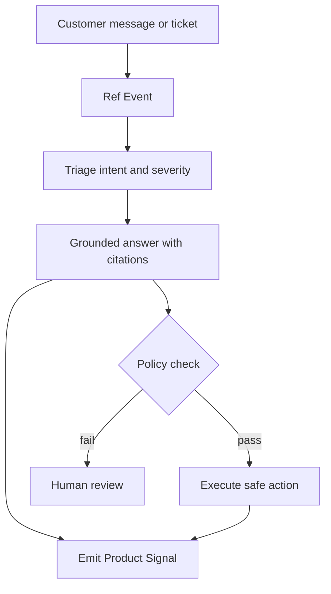
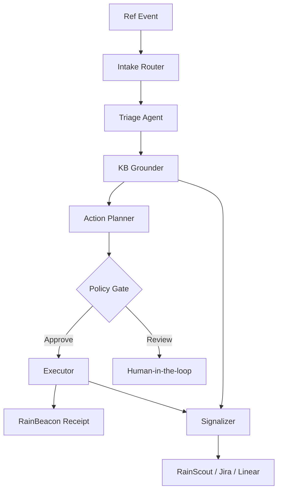
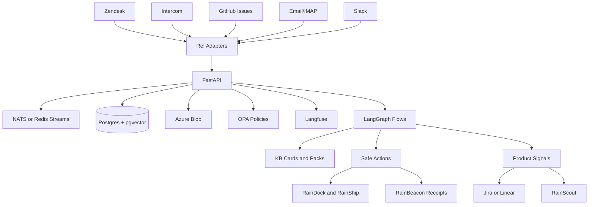
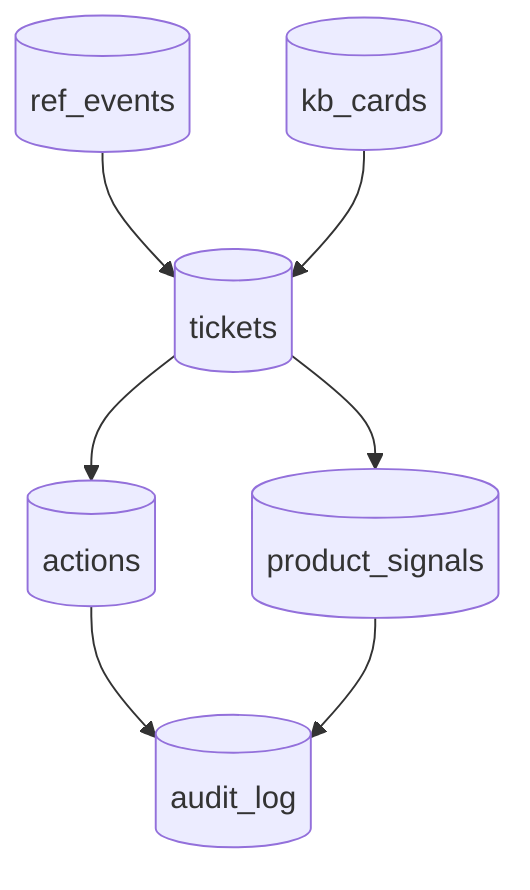

<p align="center">
  &nbsp;&nbsp;&nbsp;&nbsp;&nbsp;&nbsp;
  &nbsp;&nbsp;&nbsp;&nbsp;&nbsp;&nbsp; <br/>
  &nbsp;&nbsp;&nbsp;&nbsp;&nbsp;&nbsp;
  &nbsp;&nbsp;&nbsp;&nbsp;&nbsp;&nbsp;
</p>


#### *The Ref for real user problems: cited answers, safe actions, and clear product signals.*

RainRef is a standalone app that connects your support tools, chats, emails, and issue trackers to safe fixes and clean product signals. It helps your team answer customers with citations, run only approved actions, and send structured signals to your roadmap tools or to RainScout.

No hallucinations. Every answer has a source. Every action has a receipt.

---

## Contents

* [What RainRef Is](#what-rainref-is)
* [Who It Is For](#who-it-is-for)
* [User Stories](#user-stories)
* [Top Use Cases](#top-use-cases)
* [Buying Guide in Plain English](#buying-guide-in-plain-english)
* [Features](#features)
* [AI Agents](#ai-agents)
* [Architecture](#architecture)
* [Data Model](#data-model)
* [API Surface](#api-surface)
* [Integrations](#integrations)
* [Security and Governance](#security-and-governance)
* [Deploy](#deploy)
* [How RainRef Fits The RainStorm Suite](#how-rainref-fits-the-rainstorm-suite)
* [Roadmap](#roadmap)
* [Contributing](#contributing)
* [License](#license)

---

## What RainRef Is

RainRef is **the Ref**. It takes inputs from support tickets, chat, email, GitHub issues, Slack threads, and product telemetry. It turns them into a common shape, finds the best grounded answer with citations, proposes safe actions, and emits normalized **Product Signals** to your roadmap tools.

**Key idea:** In → Normalize → Answer with sources → Safe action → Signal out.



---

## Who It Is For

* SaaS teams on Zendesk, Intercom, Freshdesk, HubSpot Service
* Open source projects using GitHub Issues
* Agencies and MSPs who support many client apps
* Customer Success, Solutions, and Presales teams that need receipts

---

## User Stories

* As a support agent, I want the app to suggest an answer with sources so that I can reply fast and with proof.
* As a support lead, I want to approve or block actions so that fixes are safe and audited.
* As a product manager, I want clean signals grouped by theme so that I know what to build next.
* As a founder, I want a weekly report that links problems to receipts so that I can trust our process.
* As a CS leader, I want to reduce repeat tickets so that our customers stay happy.

---

## Top Use Cases

* **AI Support Copilot:** Triages tickets, drafts grounded replies, and links to the exact source.
* **Known Issue Autopatcher:** Detects a pattern, proposes a safe action, logs a receipt for every run.
* **Churn Risk Sweeper:** Spots pricing concerns or friction patterns and emits high quality signals.
* **Evidence Packs:** Exports weekly PDF or Docx of themes, counts, and receipts.

---

## Why RainRef?

* If you get many questions from customers, this tool helps you answer faster.
* It shows where the answers came from. You can see the proof at scale.
* It only runs actions that you approve. It does not go wild.
* Every action writes a receipt. You can check what happened later.
* It also makes a list of the biggest problems. This list is easy to share with your product team.
* You can start simple with email or GitHub. You can add Zendesk, Intercom, Jira, and Slack later.
* If you grow into the full RainStorm suite, your signals plug in without rework.

**Starter fit:** Small team. Two support tools. Need faster replies and simple signals.
**Growth fit:** Bigger team. Many tools. Need policy gates, receipts, and strong reporting.
**Scale fit:** SSO, strict data rules, region pinning, and custom policies.

---

## Features

* **Ref Events:** Common envelope for any inbound item
* **Triage:** Intent, severity, product area, and routing
* **Grounded Answers:** Canonical knowledge with citations
* **Policy Gated Actions:** Only run approved actions with rollback hooks
* **Receipts:** Tamper‑evident records for every action
* **Product Signals:** Bugs, frictions, feature requests, pricing objections, churn risk
* **Packs and KB:** Curated paragraphs with sources, review states, and templates
* **Dashboards:** SLA, answer quality, action safety, signal trends
* **APIs and Webhooks:** Bring your own tools and keep your flow

---

## AI Agents

RainRef uses **small, purpose‑built agents**, each boxed by policies (OPA/RainBeacon), with human‑in‑the‑loop for critical steps. You can also run in **rules‑only (no‑agent)** mode.

1. **Intake Router**
   *Job:* normalize Zendesk/Intercom/email/GitHub/Slack into a `RefEvent`.
   *Tools:* channel adapters; PII scrubber.
   *Output:* clean ticket text + metadata.

2. **Triage Agent**
   *Job:* label **intent, severity, product area**, route to playbook.
   *Tools:* lightweight classifier; SLA rules.
   *Output:* `intent`, `severity`, `playbook_id`.

3. **KB Grounder (Retrieval + Answer Composer)**
   *Job:* fetch approved **KB cards** and draft a reply **with citations**.
   *Tools:* `SearchKB` (BM25 + pgvector), citation enforcer.
   *Output:* `answer_md` + `citations[]`.

4. **Action Planner**
   *Job:* propose **safe actions** for known issues (resend activation, rotate key, apply patch).
   *Tools:* playbook library (declarative YAML), parameter extractor.
   *Output:* `actions_suggested[]`.

5. **Policy Gate** *(deterministic)*
   *Job:* **approve/block** suggested actions before execution.
   *Tools:* OPA/Rego + RainBeacon for signed receipts.
   *Output:* `policy_check_id`, allow/deny reasons.

6. **Executor**
   *Job:* call **RainDock/RainShip** or other APIs to perform the fix when policy passes.
   *Tools:* typed tool wrappers; rollback hooks.
   *Output:* `result`, `beacon_receipt_id`.

7. **Signalizer**
   *Job:* convert each resolved thread into a **ProductSignal** (bug/friction/feature/pricing/churn) for RainScout or Jira/Linear.
   *Tools:* schema mapper; dedup/grouping.
   *Output:* `ProductSignal` with evidence refs (ticket id, KB card ids, receipt id).

8. **Evaluator (Quality & Drift)**
   *Job:* score answers for citation quality; flag KB drift; catch policy near‑misses.
   *Tools:* rule checks + small LLM rubric.
   *Output:* metrics; review queue items.

9. **KB Curator (optional)**
   *Job:* suggest **canonical paragraphs** and tag fixes when patterns repeat.
   *Tools:* summarizer constrained to quoted sources.
   *Output:* draft KB card → human review → approved.

**Flow:**



**No‑agent mode:** disable generative steps; use exact‑match KB, canned replies, and deterministic playbooks—still with receipts and signals.

---

## Architecture

**Design goals:** simple to deploy, safe by default, strong audit trail, backend‑first.

* Frontend: React + TypeScript
* API: FastAPI
* Storage: Postgres for data, Azure Blob for artifacts
* Vector: pgvector in Postgres to keep infra simple
* Orchestration: LangGraph for triage, grounding, action, and signaling
* Governance: OPA policies and RainBeacon receipts
* Observability: OpenTelemetry and Langfuse



---

## Data Model

* **ref_events**
  id, source, channel, payload_json, user_ref, product, received_at
* **tickets**
  id, ref_event_id, text, severity, intent, status, product_area, created_at
* **kb_cards**
  id, title, canonical_text, tags[], sources[], trust_status, owner_id, updated_at
* **actions**
  id, ticket_id, type, params_json, result, approved_by, beacon_receipt_id, at
* **product_signals**
  id, origin, type, product_area, strength, evidence_refs[], routed_to, created_at
* **audit_log**
  id, actor, action, refs_json, signature, at



---

## API Surface

**Ref Events and Tickets**

* `POST /ref/events` — Ingest external items in a common envelope.
* `POST /support/ingest` — Convenience for ticket‑like events.

**Answer and Action**

* `POST /support/answer` — Returns answer markdown, citations, suggested actions.
* `POST /action/execute` — Runs an action through policy checks and writes a receipt.

**Signals**

* `POST /signals/emit` — Emit a Product Signal for roadmap tools or RainScout.
* `GET /signals/search` — Filter by type, product area, and strength.

**KB**

* `GET /kb/cards?query=&tags=` — Hybrid search across approved cards.
* `POST /kb/cards` — Create and update canonical text with sources.

**Audit**

* `GET /audit/:id` — Fetch a receipt by id.

**Events**

* Webhooks for `ticket.created`, `answer.proposed`, `action.executed`, `signal.emitted`.

**Typed SDKs**

* TypeScript and Python clients live in `/sdks`.

---

## Integrations

* **Ingest:** Zendesk, Intercom, Freshdesk, HubSpot Service, Email, Slack, GitHub Issues
* **Roadmap:** Jira, Linear, GitHub Projects
* **Execute:** RainDock and RainShip for safe changes
* **Observe:** OpenTelemetry, Langfuse
* **Auth:** Google, O365, Okta

---

## Security and Governance

* Role based access and reviewer gates
* Policy library for common actions
* Receipts for every action with signatures
* BYO LLM keys and region pinning
* Data retention controls and export
* No training on your private data by default

---

## Deploy

**Quick start with Docker Compose**

```yaml
version: "3.8"
services:
  api:
    build: ./api
    environment:
      - DATABASE_URL=postgresql://postgres:postgres@db:5432/rainref
      - BLOB_CONN_STRING=${BLOB_CONN_STRING}
      - OPA_URL=http://opa:8181
    ports: ["8080:8080"]
    depends_on: [db, opa]
  db:
    image: pgvector/pgvector:pg16
    environment:
      - POSTGRES_PASSWORD=postgres
      - POSTGRES_DB=rainref
    ports: ["5432:5432"]
  opa:
    image: openpolicyagent/opa:latest
    command: ["run", "--server", "/policies"]
    volumes:
      - ./infra/policies:/policies
```

Run migrations and seed scripts from `infra/migrations`.

---

## How RainRef Fits The RainStorm Suite

RainRef stands on its own. It also fits as the central **Ref** inside RainStorm. It connects support reality to the build cycle and to market sensing.

* **In:** support and usage
* **Through:** grounded answers and safe actions
* **Out:** signals for discovery and selection

```mermaid
graph TB
  RS[RainScout: <br/> Discover and pick ideas] --> RSH[RainShip" <br/> Release pipeline]
  RDK[RainDock: <br/> Provision and activation] --> RSH
  RSH --> RBN[RainBeacon: <br/> Policies and receipts]
  RBN --> RPL[RainPulse: <br/> Telemetry]
  RPL --> RRF[RainRef: <br/> The Ref]
  RRF --> RS
  RRF --> RDK
  RRF --> RSH
```

**Key contracts inside the suite**

* RainRef emits `ProductSignals` to RainScout
* RainRef calls RainDock and RainShip only through RainBeacon policies
* RainRef can attach RainPulse snapshots as evidence

---

## Roadmap

* More adapters: ServiceNow, Salesforce Cases
* Reviewer workspace and redlining for KB
* Answer quality evaluator and drift alerts
* Sandbox and canary modes for actions
* Enterprise features: SSO, SCIM, data residency

---

## Contributing

Issues and PRs are welcome. Please include:

* A clear problem statement
* Repro steps or a minimal test
* Security notes if the change touches policies or actions

Run `make test` before you open a PR.

---

## License

TBD. See `LICENSE` when available.

---

### Notes

* We avoid fluff words. We favor receipts, citations, and clear APIs.
* We do not use the words “demo” or “simulation” in this repo.
